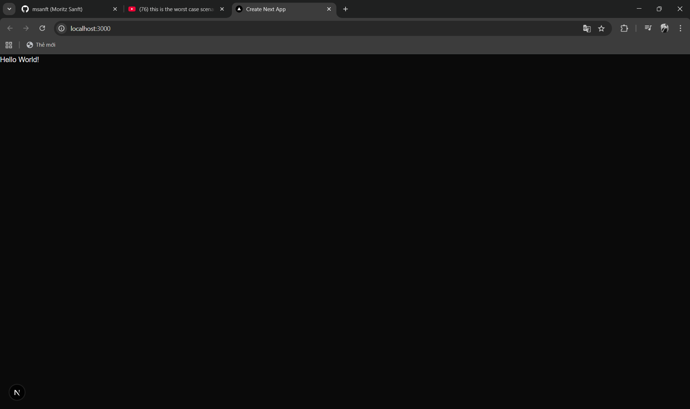

# CVE-2025-55182 — React2Shell: Full Analysis, PoC Overview, and Demonstration

**Executive summary**

This document provides a thorough analysis of CVE-2025-55182 (as known as React2Shell): a deserialization-based remote code execution (RCE) vulnerability that can arise when the React Flight Protocol (used by React Server Functions and frameworks such as Next.js) resolves inter-chunk references without sufficient validation. The chain allows exposure of the `Function` constructor and invocation of attacker-supplied code during server-side deserialization.

This repository contains an accompanying `poc.py` Proof of Concept (PoC) script to reproduce the conditions in a controlled lab environment. Only run proofs-of-concept in isolated, non-production environments.

## Table of contents

- Executive summary
- Background: React Flight protocol (RFC) and chunks
- Vulnerability analysis (root cause)
- PoC overview: how the exploit works
- Demonstration: step-by-step (safe, controlled)
- Impact and risk
- Mitigations and recommendations
- References

## Background: React Flight protocol (RFC) and chunks

React Server Functions use a binary/text protocol (often referred to as the Flight Protocol) to serialize values sent between client and server. The protocol supports "chunks" (form-data parts) that may contain references to other chunks. During request handling the server parses chunks and resolves references to reconstruct the intended objects.

Key protocol behaviors relevant to this analysis:

- Chunks are identified by numeric IDs and may reference other chunks by special tokens such as `$1`, `$@0` (raw chunk), or `$B...` (blob-prefixed values).
- Reference resolution performs lookups on objects and can traverse nested structures produced by prior resolutions.

Simplified example of legitimate chunk usage:

```py
files = {
    "0": (None, '["$1"]'),
    "1": (None, '{"object":"fruit","name":"$2:fruitName"}'),
    "2": (None, '{"fruitName":"cherry"}'),
}
```

After resolution this yields `{ object: 'fruit', name: 'cherry' }` on the server.

## Vulnerability analysis (root cause)

At a high level, the vulnerability arises from two weaknesses:

1) Inadequate validation during reference traversal — the resolver can access properties that were not explicitly set on an object (including prototype properties).

2) Treating deserialized objects as thenables (objects with callable `then`) and `await` them without ensuring they are safe to invoke.

These combine to allow an attacker, who can supply chunks, to:

- Reach prototype properties such as `__proto__` and `constructor`, exposing the `Function` constructor.
- Arrange for an object returned by deserialization to be a thenable whose `then` property triggers attacker-controlled code when awaited by server-side code.

Why this matters: server code often `await` results returned from deserialization (for example, as part of action invocation or route handling). If an awaited value invokes untrusted code during that await, the server may execute arbitrary code before any action-level validation runs.

## PoC overview: how the exploit works (high level)

The proof-of-concept exploits the React Flight Protocol features to create a sequence of transformations that culminate in a `Function` constructor invocation with attacker-controlled source. The chain uses:

- Prototype traversal to obtain `Function` (`__proto__:constructor:constructor`).
- Overwriting or supplying a `then` property so the deserialized object behaves like a thenable.
- `Chunk.prototype.then` behavior combined with `$@` (raw chunk) references to get the runtime to call fabricated chunk handlers.
- The `$B` (blob) prefix handling which performs `response._formData.get(response._prefix + obj)`, enabling control over arguments passed to a `Function` constructor call.

Core idea in three steps:

1) Leak `Function` via prototype traversal.
2) Create a crafted chunk whose `then` resolves into a function constructor call that receives an attacker-supplied string as source.
3) Ensure the crafted chunk is awaited during the normal deserialization/promise resolution flow so the constructed function executes.

### PoC payloads (conceptual)

The payloads in this repo are structured as form-data `files` mapped by numeric IDs. Examples below are conceptual and are intended for test environments only.

- Prototype access (concept):

```py
files = {
    "0": (None, '["$1:__proto__:constructor:constructor"]'),
    "1": (None, '{"x":1}'),
}
```

This leverages a reference that resolves into the prototype chain and retrieves the `Function` constructor on the server.

- Thenable construction (concept):

```py
files = {
    "0": (None, '{"then":"$1:__proto__:constructor:constructor"}'),
    "1": (None, '{"x":1}'),
}
```

Returning such an object can cause the runtime `await` to treat it as a thenable and invoke its `then`.

- Call gadget composition (concept): combine `$@` raw chunk references and `$B` blob handling to coerce a `Function` invocation with attacker-controlled source.

Full reproducible payloads are provided in `poc.py` — review and run only in an isolated test environment.

## Demonstration

### Prerequisites and Conception

This reposistory already had a test Next.js default server with a vulnerable version (16.0.6). The demonstration below shows the sequence to exercise the vulnerable path in a lab. Do not run this against production targets.

Prerequisites

- Node.js environment compatible with the vulnerable framework version.
- A local test app or instrumented handler that accepts Flight Protocol-style multipart chunk input (the `test-server/` folder in this repo contains an example Next.js layout used while researching this issue).
- A non-production or sandbox environment (VM/container) with no network access to sensitive systems.

Demonstration (Conceptual)

1) Start the test server in a controlled/sandbox environment.

```powershell
# from repo root
cd test-server
npm install
npm run dev
```

2) Prepare the form-data payload that emulate the React Flight Protocol chunks (RFC), as discussed earlier in Vulnerability analysis

3) Now send Send the multipart/form-data request to the server endpoint that accepts Server Function inputs

4) Observe server behavior and logs. In a vulnerable runtime you will see the deserialization chain execute and (in the PoC) a visible side-effect - for example a log message or a spawned process in an isolated container used for testing.

Expected result in a vulnerable environment

- The server's deserialization flow will call into attacker-supplied code before action validation occurs, demonstrating the exposed attack surface.

Notes on responsible testing

- Always test in isolated environments.
- Replace destructive payload actions with harmless side-effects (e.g., write to a temp file or emit a log) when developing proofs-of-concept.

### Actual demonstration

Here is the real demonstration to describe how React2Shell vulnerability can be exploited

First, we will start the server in a controlled/sandbox environment

```powershell
# from repo root
cd test-server
npm install
npm run dev
```

Upon loading the server, we will see a very simple page like this



This means that the Next.js app is working

Now, return back to the root folder and run the script. The `poc.py` PoC script has already contained the crafted payload that will exploit prototype pollution to gain access into Node.js internals then executes the arbitrary code (in `{EXECUTABLE}`). For experiment and demonstration purpose, we will execute a non-destructive info command, which is `whoami`

```python
python poc.py http://localhost:3000 (target server) "whoami"
```
This will return the server `whoami` information


Other executable, non-destructive commands that you can try:

id, calc (on Windows), echo "pwned", ls

Open the caculator program on target server (classic PoC demo)
```python
python poc.py http://localhost:3000 calc
```


Display full system info of the target server (assume that server is running on Windows)


Commands that you SHOULD not try

- Shutdown/reboot command: `shutdown -s -t 0` (Windows),  `reboot` (on Linux/Mac)

- Process controls

- Network exfiltrations

- package manager/installer

Any destructive commands is not allowed

## Impact and risk

- Severity: Critical (CVSS: 10) — remote code execution in server-side request handling.
- Risk factors: any application that accepts or proxies Flight Protocol chunk input from untrusted sources; server handlers that `await` deserialized values without strict validation.

## Mitigations and recommendations

Short-term

- Patch or upgrade to React/Next.js versions containing the remediation (see references).
- Filter and validate chunk references. Reject tokens that explicitly traverse prototype chains (for example `__proto__`, `constructor`).

Medium-/long-term

- Treat deserialized values as untrusted: do not directly `await` or call properties (like `then`) without type checks.
- Harden server-side parsing to avoid interpreting untrusted data as control tokens.
- Add unit and fuzz tests that cover prototype traversal and thenable invocation.

## References

- React Server Functions: https://react.dev/reference/rsc/server-functions
- Understanding React Server Components / Flight Protocol: https://tonyalicea.dev/blog/understanding-react-server-components/
- Reactive fix/commit: https://github.com/facebook/react/pull/35277/commits/e2fd5dc6ad973dd3f220056404d0ae0a8707998d
- MDN: Object prototypes: https://developer.mozilla.org/en-US/docs/Learn_web_development/Extensions/Advanced_JavaScript_objects/Object_prototypes
- MDN: Function constructor: https://developer.mozilla.org/en-US/docs/Web/JavaScript/Reference/Global_Objects/Function/Function
- Credit / idea source: @maple3142: https://x.com/maple3142

## Acknowledgements

Special thanks to **Morizt Sanft** (Github link: https://github.com/msanft) who creating this PoC script with the full analysis about React2Shell vulnerability and **Low Level** (Youtube channel link: https://www.youtube.com/@LowLevelTV) for demonstrating this vulnerability and its results
